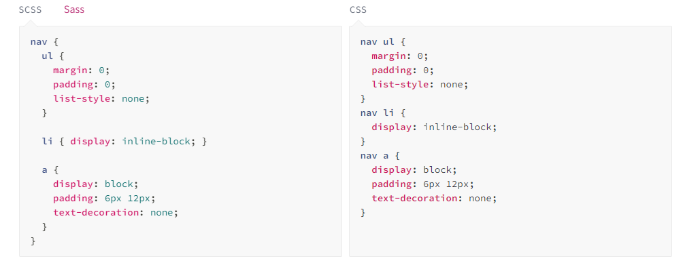

# 同济大学“天行”气象预测平台

总负责人：冯新

前端负责人：沈天宇

前端开发小组1：（ENSO：预测结果+预测检验）
林颖、苏锦添、朱乐怡

前端开发小组2：（海冰：预测结果+预测检验）
王宜沣、芮千栒


## 技术栈

打包工具：Vite

前端框架：Vue

组件库：Element Plus

图表组件库：Echarts

## 建议开发工具

- [WebStorm](https://www.jetbrains.com/webstorm/)

## 运行方式

1.安装nodejs

2.npm换淘宝源
```shell
npm config set registry https://registry.npm.taobao.org
```

3.运行命令

```shell
git clone https://github.com/FXsGithub/TianXing-Frontend
cd TianXing-Frontend
npm install 
npm run dev
```

## 发布方式

运行命令

```shell
npm run build
```

即可调用打包工具vite打包产生dist目录，dist目录内即为可部署的网站。

## 其他说明

### 关于Sass

sass是css的一个超集，兼容css，在sass文件里可以直接写css格式的代码，但更推荐使用sass的语法，这也是现在大厂主流的开发方式。（英文文档：https://sass-lang.com/guide/ 中文教程：https://www.sass.hk/docs/ 这个非常简单，很容易掌握，不需要什么学习成本）

vite在打包的时候会自动将sass转化为css，不需要额外的操作，例如下图中，左边的sass代码会在打包后自动转化为右边的形式：



### 关于Mock

Mock技术可以在前端模拟接口返回数据，这样在开发的时候就不用等后端接口开发完再开发前端了，等后端接口开发完了，把是否使用mock从true变为false即可和后端成功对接，非常方便，这也是目前大厂前端程序员开发的主要技巧之一。
