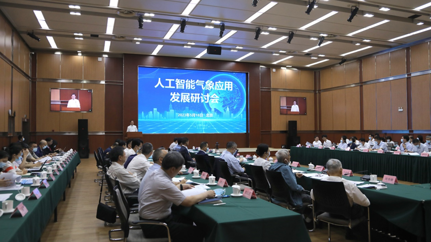

# 穆斌教授在全国“人工智能气象应用发展研讨会”上做特邀报告
###### 发布时间：2023-05-19

应中国气象局邀请，软件学院副院长穆斌教授于5月18日出席在北京举办的全国“人工智能气象应用发展研讨会”，并在大会上做题为“人工智能气象应用的物理一致性和可解释性研究”的特邀学术报告。

穆斌教授的特邀报告详细阐述了如何将动力方程、对称性、守恒律等重要物理机制融入AI模型，并采用因果推断和动力机制挖掘算法以增强AI模型可解释性的理论、方法和技术。学院AI+大气海洋研究团队在ENSO（厄尔尼诺-南方涛动）智能预测、NAO（北大西洋涛动）智能预测、北极海冰智能预测、台风智能定强与风结构估计等方面的优秀研究成果引起中国气象局领导和与会院士专家的高度重视。包括中国气象科学研究院和国家气候中心在内的国家级研究机构均纷纷表示要进一步强化与学院业已存在的合作关系、提升合作层次，以期产出更加卓越的交叉研究成果。

 
大会新闻链接：

https://www.cma.gov.cn/2011xwzx/2011xqxxw/2011xqxyw/202305/t20230518_5516082.html

https://www.cma.gov.cn/2011xwzx/2011xqxxw/2011xqxyw/202305/t20230518_5516083.html

